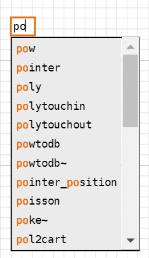
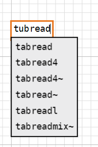

# Google Summer Of Code 2024 Report: Incrementally Improve Auto-Completion Feature
Final report about the project "Incrementally improve the auto-complete feature" in Purr Data.

## Project Overview

This project was aimed at incrementally improving the existing Auto-Completion feature in Purr Data with a series of bug fixes and enhancements to better its UX. The project was successfully completed with all the milestones achieved except a few.

***
Here are the changes and additions made during the contribution period
- Addition of Scroll bar to the completion drop-down list 

The drop-down list for auto-completion had a fixed size of 8 items which was not enough to display all the items in the list. This was fixed by adding a scroll bar to the drop-down list so that the user can scroll through the list to view all the items.

Also the functionality of navigating through the list using the arrow keys was added.

| Before the fix | After the fix |
|:--------------:|:-------------:|
|  |  |

- Addition of text highlighting to the completion drop-down list 
The completion drop-down list was enhanced by adding text highlighting to the items in the list. This was done to make it easier for the user to identify the matching items in the list and to make the suggestions stand out.

- Addition of tooltip to the completion drop-down list 
A tooltip was added to the completion drop-down list suggestions to display the desscription of the item when the user hovers over an item in the list. This was done to make it easier for the new users to better use the objects in the list.

- Addition of fuzzy matching to the autocompletion feature 
A fuzzy search option was added to the autocomplete feature, allowing users to find approximate matches rather than exact ones for their search queries. Additionally, results are displayed even if caps lock is on or words are capitalized. The fuzzy search functions with the autocompletion prefix, whether it's enabled (matching objects by the prefix entered in the search box) or disabled. Additionally a checkbox was added in GUI tab in the preference dialog to enable and disable fuzzy matching.

- Addition of checkbox for clearing and resseting the help/autocompletion index 
A checkbox has been introduced, providing users with the option to clear and reset the help/autocompletion index. This feature enhances the user experience by offering a straightforward way to refresh or restart the index, instead of having to do it manually by searching the necessary files and deleting them. Users can choose to reset index along with clearing 

- Addition of issue/feedback tab to preference dialog 
A new "Issue" tab has been added to the existing four tabs in the preferences dialog, allowing users to submit issues or feedback directly to the Purr Data GitHub repository. Users must be logged into GitHub to use this feature. When the submit button is clicked, the issue creation page for Purr Data opens in the user's default browser with all relevant fields pre-filled.

## Code
[**Link to the Pull request and commit of all the changes made**](https://github.com/agraef/purr-data/compare/3e28a71e618b8c2a53142bc5ef8cb34104e909dc...ayush-gsoc24-submission)

## Future Enhancements
The tooltip for the completion object can be made better by adding the inlets,outlets and arguments required by the object.

## Acknowledgement
Working on this year’s GSoC project was a blast. I had a great time thanks to my mentor Albert Gräf, and the help from Jonathan Wilkes and Matt Barber made everything go smoothly.

